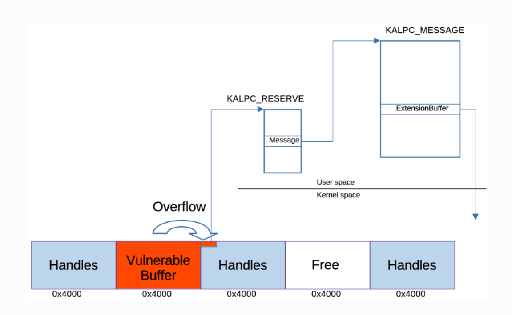

# Information

Windows Kernel Pool (clfs.sys) Corruption Privilege Escalation. (CVE-2023-36424)

This repo contains technical analysis & working exploit.

Author: Nassim Asrir (@p1k4l4) || https://www.linkedin.com/in/nassim-asrir-b73a57122/

# Vulnerability
There is a pool overflow in cldflt.sys mini filter driver. Information on this can be read on:

1 - https://googleprojectzero.blogspot.com/2021/01/hunting-for-bugs-in-windows-mini-filter.html

2 - https://www.zerodayinitiative.com/blog/2021/7/19/cve-2021-31969-underflowing-in-the-clouds

The reason is that the driver is not sufficiently checks a data that comes from NTFS reparse point.

We will consider cldflt.sys version 10.0.22621.2134 (Windows 11 22H2 22621.2215)

The function HsmFltProcessHSMControl is responsible for processing cloud filter FSCTLs. For an operation with code 0xC0000003 , it will eventually call HsmFltProcessUpdatePlaceholder . 

After some processing the execution flow will reach HsmiOpUpdatePlaceholderDirectory and then finally HsmpRpCommitNoLock: 

````__int64 __fastcall HsmpRpCommitNoLock(__int64 a1, __int64 a2, struct _FILE_OBJECT *a3, char a4, char a5)

{ //.....

v26 = FileObject; LODWORD(v9) = HsmpRpReadBuffer(*(PFLT_INSTANCE *)(v164 + 32), FileObject, (unsigned __int16 **)&P); // [1*]

HsmDbgBreakOnStatus((unsigned int)v9);

if ( (_DWORD)v9 == -1073741195 ) //.....

goto LABEL_55; }

if ( (v9 & 0x80000000) != 0i64 )

goto LABEL_9;}
 

if ( (*(_DWORD *)P & 0xFFFF0FFF) != dword_1C0027650 )// Is
Cloud Reparse Tag?
{
LODWORD(v9) = 0xC000CF0B;
//.....
goto LABEL_54;
}
v32 = *((unsigned __int16 *)P + 2);
v9 = (unsigned int)HsmpRpValidateBuffer((__int64)P + 8, v32);
// [2*]
//.....
Pool2 = ExAllocatePool2(0x100i64, 0x4000i64, 'pRsH'); // [3*]
v146 = (_DWORD *)Pool2;
v13 = (void *)Pool2;
if ( Pool2 )
{
v64 = v159_10;
v65 = Pool2 + 4;
if ( v8 && *((_WORD *)v8 + 7) > 0xAu )
v64 = *((_WORD *)v8 + 7);
v9 = Pool2 + 20;
v66 = (unsigned int *)(Pool2 + 12);
*(_OWORD *)v65 = 0i64;
*(_WORD *)(Pool2 + 16) = 0;
*(_WORD *)(Pool2 + 18) = v64;
*(_DWORD *)(Pool2 + 12) = 8 * v64 + 16;
*(_DWORD *)v65 = 'pReF';
memset((void *)(Pool2 + 20), 0, 8i64 * v64);
//.....
if ( v8 )
{
v127 = 10;
if ( *((_WORD *)v8 + 7) > 0xAu ) // [4*]
{
if ( WPP_GLOBAL_Control !=
(PDEVICE_OBJECT)&WPP_GLOBAL_Control
&& (HIDWORD(WPP_GLOBAL_Control->Timer) & 1) != 0

&& BYTE1(WPP_GLOBAL_Control->Timer) >= 4u )
{
WPP_SF_qiq(WPP_GLOBAL_Control->AttachedDevice, v86,
v87, a2, *(_QWORD *)(v156 + 32), FileObject);
}
while ( v127 < *((_WORD *)v8 + 7) )
{
*(_QWORD *)(v65 + 8i64 * v127 + 16) = *(_QWORD
*)&v8[8 * v127 + 16];
memmove(
(void *)(v65 + *v66),
&v8[*(unsigned int *)&v8[8 * v127 + 20]],
*(unsigned __int16 *)&v8[8 * v127 + 18]); //
[5*]
*(_DWORD *)(v65 + 8i64 * v127 + 20) = *v66;
*v66 += *(unsigned __int16 *)(v65 + 8i64 * v127++ +
18);
}
}
}
//.....
}````

HsmpRpReadBuffer [1*] retrieves reparse point data. This data contains WORD-size value *((_WORD *)v8 + 7) , specifying a count of the structured items. Each item has a Type field, Size and Offset to data fields. 

Which item type in which place is strictly predetermined. But only for the first 10 ones. For example, the type field of the first item must have a value equal to 0x7.

The driver will execute HsmpRpValidateBuffer [2*] to verify acquired data. Then [3*] will be allocated paged pool with fixed 0x4000 bytes size. And if reparsed point data has a Count value more than 10, then the

data of the items after the tenth will be copied into this fixed-size pool [4*] without any additional checks.

The validation inside HsmpRpValidateBuffer is insufficiant, because it checks only first 10 records. 

````__int64 __fastcall HsmpRpValidateBuffer(__int64 pBuf, unsigned int a2)
{
//.....
v2 = a2 - 4;
pBuf2 = pBuf + 4;
LOBYTE(v5) = 0;
v6 = 0i64;
if ( a2 <= 4 )
v2 = 0;
v7 = 0;
v8 = *(_DWORD *)pBuf & 0xF;
if ( !v8 )
{
//.....
return IsReparseBufferSupported;
}
if ( v8 > 1 )
{
//.....
}
v9 = 0;
v66 = 0;
if ( v2 < 0x18 )
goto ERROR_EXIT;
v9 = 1;
if ( *(_DWORD *)pBuf2 != 'pReF' )
goto ERROR_EXIT;
v9 = 2;
v10 = (unsigned int *)(pBuf + 0xC);
if ( (*(_BYTE *)(pBuf + 16) & 2) != 0 && *(_DWORD *)(pBuf +
8) != RtlComputeCrc32(0, (PUCHAR)(pBuf + 0xC), v2 - 8) )
goto ERROR_EXIT;
v11 = *v10;
v9 = 3;
if ( v2 < (unsigned int)v11 )
goto ERROR_EXIT;
v12 = *(unsigned __int16 *)(pBuf2 + 0xE);
v9 = 4;
if ( !(_WORD)v12 )
goto ERROR_EXIT;
v13 = 8 * v12 + 16;

v9 = 5;
if ( v13 >= v11 )
goto ERROR_EXIT;
v9 = 0x10000;
for ( i = 0; ; ++i )
{
v15 = *(unsigned __int16 *)(pBuf2 + 0xE);
if ( (unsigned int)v12 >= 0xA ) // [1*]
v15 = 10;
if ( i >= v15 )
break;
//.....
}````

As we can see [1*] the code will verify only the first 10 items and ignores the case when there are more records.

# Exploitation

The size of the vulnerable pool is 0x4000. The size is a multiple of page and therefore the segment allocation will be used [3].

For exploitation was used the technique described here[4]. Calling NtAlpcCreateResourceReserve will create a lot of handles and ovewriting one of them with the pointer to constructed fake _KALPC_RESERVE object will give us the ability to write to arbitrary kernel address.

To prepare the memory, we sequentially allocating pools of 0x4000 size, using pipes[5]. Then we will free every second pool, provide a place for vulnerable buffer. 



To read an arbitrary kernel address, the exploit utilised pipes. For this purpose we will overwrite AttributeValue pointer of the PipeAttribute structure. 


And afterwards, we can steal system token to overwrite token in the target process. 

Thanks for reading.
 

